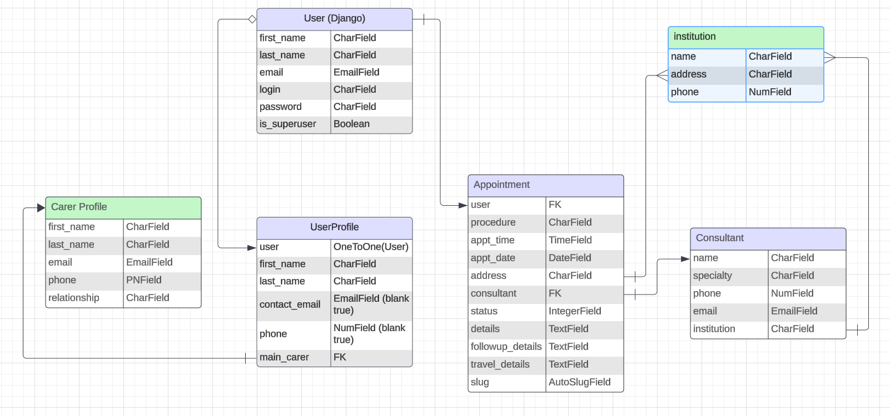
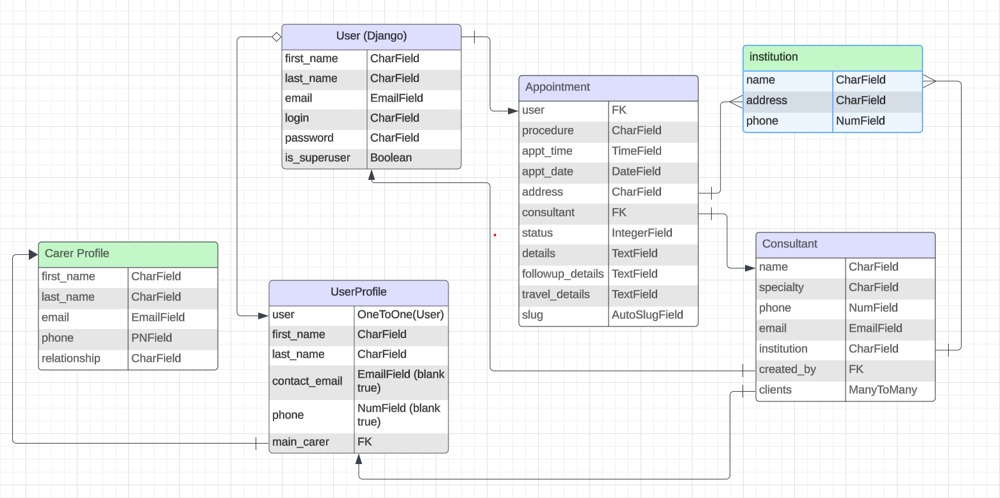
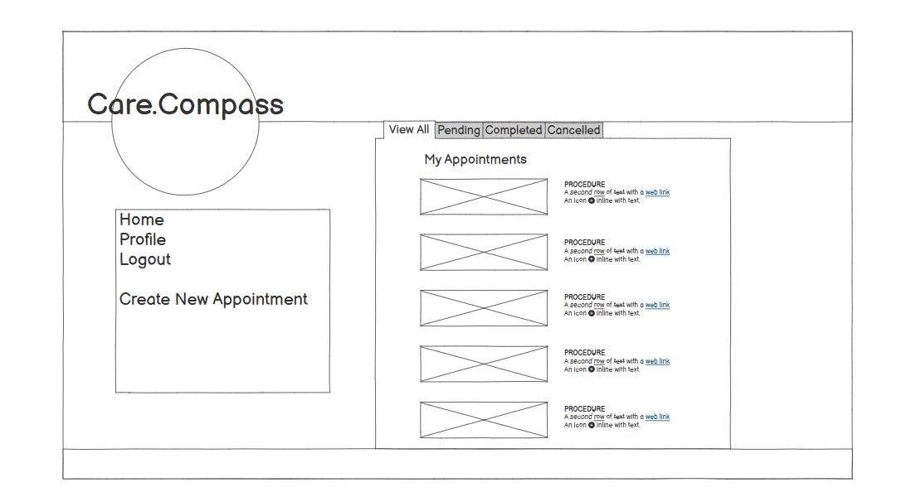
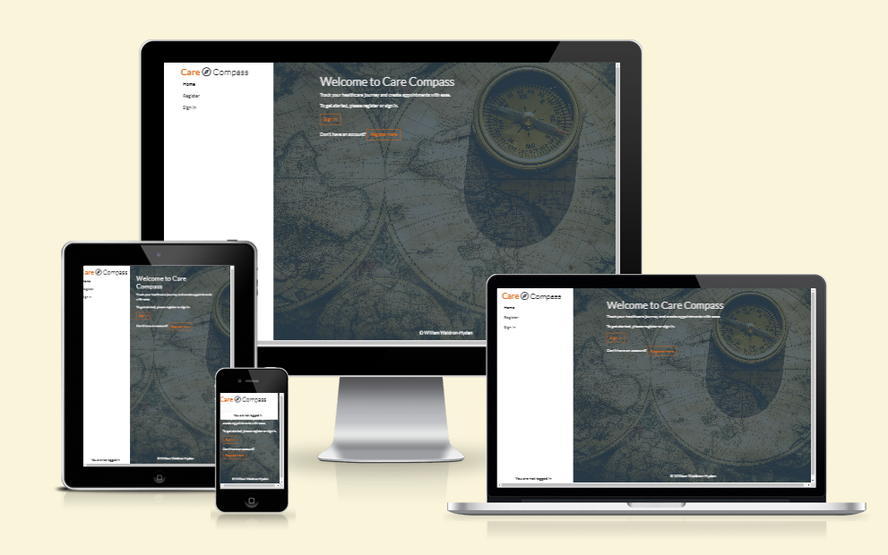
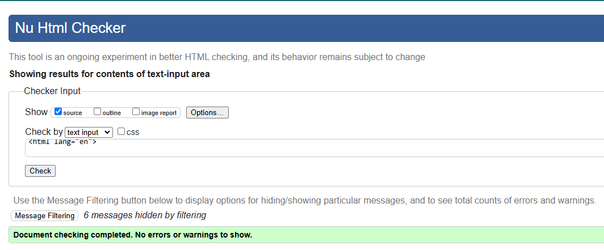
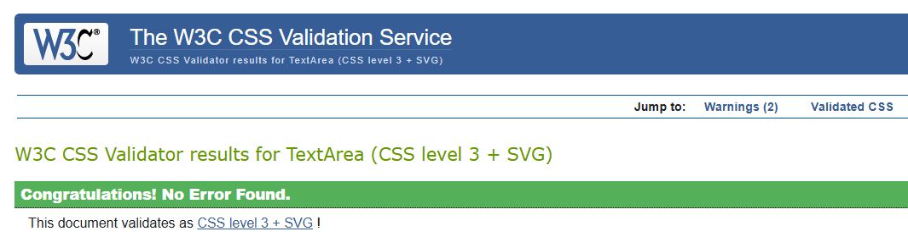

# 

# Welcome to "CareCompass"

## A Healthcare Appointment Tracker
### CareCompass is an app for cancer patients and other people with chronic illness, which allows users to consolidate a record of medical appointments and procedures.

The responsive website allows registered users to create entries for medical appointments, where they can track key information such as location, follow-up details, and their travel plans for getting to and from their appointments. Users who are not registered can sign up for free. 

# [Link to Live Site](https://care-compass-app-b1851415864d.herokuapp.com/)  

*This project is created as a final full-stack personal assessment for the 2024 Code Institute Full-Stack Developer Bootcamp.*

### **Built by William Waldron-Hyden**

---

# Table of Contents  

 1. [UX](#ux)
 2. [Agile Development](#agile-development)
 3. [Features Implemented](#features-implemented)  
 4. [Features Left to Implement](#features-left-to-implement)  
 5. [Technology Used](#technology-used) 
 6. [Testing](#testing-and-validation)  
 7. [Bugs](#known-bugs)  
 8. [Deployment](#deployment)
 9. [Resources](#resources)  
 10. [Credits and Acknowledgements](#credits-and-acknowledgements)

---

# UX

## Database Planning

Describe your database planning process and include diagrams if available.

To plan out the Database relationships, I used Lucidchart to create the entity relationship diagrams and understand how I wanted each model to relate to each other.

The tables in blue were MVP, whereas the tables in green are areas of potential development. 

Although the relationships changed over time in development, this initial plan was useful to begin building the project. 

Further changes later into the project included expanding the Consultant field to allow a many-to-many relationship with User Profiles.
This enabled Consultants to be referenced on multiple different user's Profiles

## UX Design

### Overview
Care Compass is intended to present a minimalist and modern design that immediately presents its utility to the user. The UX design focuses on providing a calm and straightforward presentation in terms of layout and color choice. On the main page, appointments are immediately available for review, easy to access and reference at a glance. To ensure convenience, all core functions of the site are just one or two clicks away, with a responsive design to accomodate users anywhere they are. 

### Site User
The primary users of the site are cancer patients, as well as people with chronic illness. Many cancer patients have trouble keeping track of their many appointments. Their medical team also may not have good communication in their care, particularly when care is spread across different hospitals. There is a need for a clear medical history to be provided to consultants, as well as an ‘address book’ of a patient’s health team to improve communication and streamline their treatment journey.

### Goal
The goal of Care Compass is to ensure a user has a central point of reference for any critical details they need to remember in their healthcare journey. It is an app that will allow the user to create records of medical appointments and record additional details and information which might otherwise be forgotten or misplaced. It will also allow the user to link appointments to doctor/consultant profiles (who may be created users on the database). 

In future development, they will also be able to create a Carer Group where non-patient users can see their history, doctors, and appointments, which will allow the user’s carers to retrieve crucial information and get in touch with doctors in an emergency. 

With this app, the user can ensure their various consultants can easily communicate with one another, and that the user can better organize their time and minimize the stress that is already so prevealant in long term healthcare. 

## Wireframes

I used Balsamiq to create my wireframes. The final project looks different from the initial outline, which included filter controls. I wasn't able to include appointment list filtering in the initial deployment, but the overall approach has remained the same. I wanted a nav menu on the left hand side for wider screens that would collapse into an overhead menu on smaller screens. To the right, occupying the space of the page, are the appointment cards which display the list of appointments the user has. 

The focus was on a simple column display to accomodate a large number of appointments. This approach continued in the Profile page. 

Due to the time limitations on this project, I focused on iterating off my initial wireframe idea, rather than re-draft additional wireframes for individual pages. 

##### [ Back to Top ](#table-of-contents)

# Agile Development

For the development of this project, I adopted an Agile methedology to allow iterative and efficient progress throughout the project development cycle. A core tool in this process was the use of a Kanban board hosted on GitHub Projects. This board can be viewed here: 

#### Project Board Overview
The board was divided into a simple set of stacks:
- "To Do" is the initial creation zone, for upcoming or desired tasks. 
- "Doing" was to keep focus on priority tasks.
- "Done" is completed/achieved tasks. 
- "Won't Do" are tasks deemed valuable but not MVP for this release, and will be revisited for future development of the project. 
- "Bugs" is the stack to keep track of identified bugs and issues with the code.

User Stories formed the core of the tasklist in this project. But later in development as new issues and bugs arose, a more simple format of brief tasks was adopted for efficiency. Using this approach, the development of Care Compass remained focused on maximising value from the MVP aspects of the project, flexible and responsive to issues as they arose in development. 

### User Stories Overview

1. Create Appointments
   - As a patient, I can create a medical appointment record, so that I can easily reference details about my upcoming appointments

2. View Paginated Appointment List
  - As a patient, I can view a list of my appointments, so that I can review my full medical history journey

3. View Appointment Details
  - As a patient, I can click on an appointment, so that I can see the full information available

4. Profile Page/Address Book
  - As a user, I can view my profile page, so that I can view my consultant list and care team contact information

5. Profile Page/Address Book
  - As a user, I can view my profile page, so that I can view my consultant list and care team contact information

6. Adding Consultants
  - As a user, I can add a doctor/care team member, so that gather a list of members of my care team and consultants and be able to quickly locate their contact information and share it

7. Account Registration
  - As a user, I can log in, so that I access my own account details and view my personal appointments

8. List View for Consultants
  - As a site owner, I can display a list view of my consultants within the profile page, so that information across different apps is accessed and users may view specific details and edit/delete them if needed.

##### [ Back to Top ](#table-of-contents)

# Features Implemented

## Home Page
- Appointments are displayed as cards. 
- Users can click on a card to view the entire appointment.
- Users must be logged in to view and create appointments. 
- Users can only view their own appointments or profile page. 
- Users can edit or delete their own appointments. 

## Nav Bar
- Navigation links allow easy navigation from appointments to profile, and ensure users can always create an appointment with one tap. 
- Navigation bar anchors to the left on wide screens and the top of the page in smaller screens. 

## Profile Page
- Users can view their profile information, and edit it.
- Users can delete their entire account from here. 
- Users can view a list of their consultants, which represents their 'address book.' 
- Consultants list populates from any consultants the user created OR selected from the 'public' consultants during an appointment. 
- Consultants are displayed as a card, users can click 'more' to expand the cards.
- Users can edit or delete the consultants they created. 
- Users can create consuntants on this page. 

## Login Page
- Secure signup functionality allows users to register securely.
- Successful login redirects users to the home page.

## Registration Page
- Secure login functionality allows users to log in and maintain account security.
- Successful registration redirects users to the home page.

## Logout Page
- Logout functionality allows users to sign out securely.
- After successful logout, users are redirected to the home page.

### Responsive Design
- The website is designed to be responsive, ensuring optimal usability across a range of devices.
- Navbar is responsive in style, anchoring to the left hand of the screen on wide screens, and collapses to the top on small screens. 
- Bootstrap 

## Additional Security Features
- Prevents brute force access of database via URL
- Users are directed to the login page or a 'forbidden' page if they attempt unauthorized actions. 
- Users cannot view, edit, or delete other user's appointments.
- Users can view Consultants created by other users if the consultant is set to Public. Users cannot edit or delete these consultants. 

##### [ Back to Top ](#table-of-contents)

# Future Features

### Care Team 
- Users can add another user as a member of their 'Care Team'.
- Members of the 'Care Team' can view more information on one another's Profile, allowing key information such as contact information and consultant list to be viewed. 
- This is key as the target audience will likely have support from other people, and this ensures critical information can be viewed even if the User isn't able to access their account in a crisis. 

### Expanded Profiles
- Expanding Profile permissions to allow a limited view of a user's profile by other users. 
- Currently, a user can only view their own profile. This update would allow them to share a limited amount of info publicly. 
- The Care Team would be able to view a wider level of information. 

### Expanded Consultants control
- Allow users to search a list of public Consultants. 
- Set up 'Institutions' to allow users to view a list of consultants associated with that institution (ie, doctors/surgeons/nurses in a particulat hospital)
- Improve logic and handling of Consultants to ensure only publicly available information is used. Potentially implement an approval system where admins need to verify a consultant entry before it can be made Public - limits abuse.

### Search and Filter Appointments
- Improving appointment lists by adding filtering options, and a 'search' function.
- Users can search by 'status', 'consultant', 'date range', etc. Users can apply multiple filters to the view.
- Users can choose to paginate the results or list all on infinite scroll. 

### Improved UX
- Introducing an improved landing page/about page to better explain the use of the site to new users.
- Implementing UX improvements to appointment cards and detail pages. 

##### [ Back to Top ](#table-of-contents)

# Technology Stack

- HTML - for page structure
- CSS - for custom styling
- Python - for the backend
- Javascript - for event listeners on buttons and added functionality 
- Django - framework used to build this project
- Bootstrap 5 - front end framework used for styling
- Bootswatch - customization theme for Bootstrap
- PostgreSQL from Code Institute - used as the database
- Google Fonts- for custom font styling
- GitHub - for storing the project
- Git - for version control
- GitPod - IDE for the project
- Heroku - for hosting and deployement of this project
- Clip Studio - for editing pngs
- Balsamiq - for wireframes
- Font Awesome - for social media icons
- Lucidchart - for database ER diagrams
- Pexels - for free stock images

##### [ Back to Top ](#table-of-contents)

# Testing and Validation

### Responsiveness
I used Chrome dev tools to test for responsiveness, using Bootstrap classes to build in most of the flexible structure in the site. One exception is the navbar, where a media query is used to set the navbar section's height to 100VH on larger screens, which works with the Bootstrap classes to ensure a left-hand anchored menu on large screens and a top-anchored, collapsing menu on small screens. 

[Preview generated at UI.dev](https://ui.dev/amiresponsive)

### Testing and Validation

- I used the [W3 HTML Validator](https://validator.w3.org/#validate_by_input+with_options) to check the HTML on each of my site pages by Direct Input. HTML validation reported certain errors that I am aware of, and have chosen not to address at this time:
1. The element button must not appear as a descendant of the a element. [s/login/"><button type="button" class="btn btn-outline-primary">Sign In]
2. Duplicate ID deleteModalLabel.
3. The first occurrence of ID deleteModalLabel was here.

These issues do not affect functionality, and can be addressed in later development. The issue of the button being a decendant of a link is due to preference for the visual appearance it has on the screen, and more time is needed to find a better implementation of this through custom css. 

The issue of the deleteModalLabel is due to how the project implemented a second custom modal, and more time is needed to find a better implementation. 

- I used the [W3 CSS Validator](https://jigsaw.w3.org/css-validator/#validate_by_input) to check the CSS of my page via direct input. There were no errors, and 2 warnings regartding vendor extentions. 

### HOME PAGE

| Test                                    | Result |
|-----------------------------------------|--------|
| Appointment list displayed as cards         | Pass   |
| Appointments displayed in order of appointment date | Pass |
| Appointment list only viewable on login | Pass |
| Site Description/Blurb available to logged out users | Pass |
| Navbar responsiveness | Pass |
| Ability to click on Appointments | Pass |
| Ability to click on Navbar elements | Pass |
| Ability to click on 'Create Appointment | Pass |
| Creation limited to logged in users | Pass |  

### NAVBAR
| Test                                    | Result |
|-----------------------------------------|--------|
| Navbar responsiveness | Pass |
| Ability to click on Navbar elements | Pass |
| Ability to click on 'Create Appointment' | Pass |
| Navbar extends to 100VH on large screens | Pass |

### APPOINTMENT DETAILS PAGE

| Test                                    | Result |
|-----------------------------------------|--------|
| Appointment details only viewable when logged in | Pass | 
| Clicking on appointment leads to correct appointment | Pass | 
| Create Appointment form functionality  | Pass |
| Edit Appointment form functionality | Pass | 
| Delete Appointment functionality | Pass |
| Edit/Delete only possible to logged in user | Pass |
| Responsive CSS to Appointment Status functions | Pass |

### PROFILE PAGE

| Test                                    | Result |
|-----------------------------------------|--------|
| Profile created on user creation | Pass | 
| Profile displays only to logged in users | Pass | 
| Displays edited profile information | Pass | 
| Edit profile form functionality exists | Pass | 
| Delete profile deletes account correctly | Pass | 
| List of Consultants displays correctly | Pass | 
| Consultant Create link to form functionality | Pass | 
| Consultant card dropdowns function correctly | Pass | 
| Edit consultant form functionality | Pass | 
| Delect consultant form functionality | Pass | 
| Only edit/delete consultants created by user | Pass | 

### LOGIN PAGE

| Test                                    | Result |
|-----------------------------------------|--------|
| Secure login functionality | Pass |
| Redirect after successful login | Pass |  

### REGISTRATION PAGE

| Test                                    | Result |
|-----------------------------------------|--------|
| Secure signup functionality | Pass |
| Redirect after successful signup | Pass |  

### LOGOUT PAGE

| Test                                    | Result |
|-----------------------------------------|--------|
| Secure logout functionality | Pass |
| Redirect after successful logout | Pass |   

### SECURITY

| Test                                    | Result |
|-----------------------------------------|--------|
| Prevention of brute force actions via URL	 | Pass |
| Redirect to sign-in page or 403 error page after attempted unauthorized action	 | Pass |

##### [ Back to Top ](#table-of-contents)

# Known Bugs

- Notification messages for successful actions (creating/editing appointments or consultants) will not disappear. This should be basic functionality from bootstrap but it is not functioning correctly. Further investigation needed to improve the user experience on this front. 
- Appointment time should be limited to 5 minute intervals. Currently the form will not allow users to submit a form if the time is not in a 5-minute interval, but the selection widget still allows invalid intervals to be selected. Changes need to be investigated for the form.
- Navbar responsiveness - on certain medium screens the navbar will not extend to 100VH as intended. 
- Image uploads - initially, image uploading was intended so users could set their own profile page. This has been removed due to persistant issues with the Cloudinary connection. 

##### [ Back to Top ](#table-of-contents)

# Deployment 

## Deployment Guide 

### Deployment Steps

#### Creating the Heroku App

- Sign up or log in to Heroku.
- In the Heroku Dashboard, click "New" and select "Create New App."
- Choose a unique name for your project (e.g., "Care Compass").
- Select the EU region and click "Create App."
- Navigate to the "Deploy" tab in Heroku.
- Choose GitHub as the deployment method.
- Connect your GitHub account and link your GitHub repository.

#### Setting Up Environment Variables

- Create an `env.py` file in the top-level directory of the Django app.
- Import os in `env.py`.
- Add necessary environment variables (e.g., secret key, database URL) in `env.py`.
- Update `settings.py` to use environment variables for the secret key and database configuration, referencing the `env.py` values.
- Add environment variables to the "Config Vars" section under the "Settings" tab in Heroku.
- Run `manage.py makemigrations/migrations` in the terminal to connect models to the new database.
- Update `settings.py` to configure static files and template directories in the desired locations within the project.
- Add "Heroku" to the `ALLOWED_HOSTS` list.

#### Creating Procfile and Pushing Changes

- Create a `Procfile` in the top-level directory of your project.
- Add the command to run the project in the `Procfile`.
- Add, commit, and push changes to your GitHub repository.

#### Heroku Deployment

- Go to the "Deploy" tab in Heroku and manually deploy the branch.
- Monitor the build logs for any errors.
- Upon successful deployment, Heroku will display a link to the live site.
- Resolve any deployment errors by adjusting the code as needed.
- Ensure Heroku uses Ecodynos to minimize costs on small projects like this. 

### Forking the Repository
Forking the repository allows you to create a copy of the project without affecting it. To do so, follow these steps:

- Log in to GitHub or create an account.
- Visit the repository link for "Care Compass."
- Click on "Fork" at the top of the repository.

### Creating a Clone of the Repository
Cloning the repository allows you to create a local copy of the repository. To do so, follow these steps:

- Navigate to the "Care Compass" repository on GitHub.
- Click on the "Code" button and select the "HTTPS" option under the "Local" tab.
- Copy the repository URL.
- Open your terminal and navigate to your desired directory.
- Use the command git clone [copied repository URL] to clone the repository locally.

##### [ Back to Top ](#table-of-contents)

# Resources

- [Code Institute Full Stack Developer Bootcamp resources](https://codeinstitute.net/)
- [Django Docs](https://www.djangoproject.com/)
- [Crispy Forms docs](https://django-crispy-forms.readthedocs.io/en/latest/)
- [Bootstrap Docs](https://getbootstrap.com/)
- [Bootswatch custom themes](https://bootswatch.com/)
- [Stack Overflow](https://stackoverflow.com/)
- [ChatGPT](https://chatgpt.com/)
- [Balsamiq](https://balsamiq.cloud/)
- [LucidChart](https://lucid.app/)
- [Code Institute Slack](https://slack.com/)

##### [ Back to Top ](#table-of-contents)

# Credits and Acknowledgements

## Images

- The Care Compass icon and favicon is from Font Awesome's free library. 
- Background map/compass image is from royalty free stock photos on [Pexels](https://www.pexels.com/)
- Site theme based on Superhero from [Bootswatch](https://bootswatch.com/)

## Code

- **Code Institute** course content - provided instructional basis for the project, guidance and knowledge from SME, facilitators, and fellow students. The blog codealong project served as the core reference for early development, and certain elements such as a few CSS style examples and JS functions were implemented here as well. 
- **Code Institute github project references** - sample past projects provided for reference, which inspired new functionality and gave new examples of code to implement. In particular, GitHub user TulaUnogi and the [Cat Beans Cafe](https://github.com/TulaUnogi/cat-beans-cafe) project.
- **ChatGPT** for debugging and troubleshooting, as well as referencing possible solutions and approaches to my code. 
- **Stack Overflow** for discussing and identifying unusual errors, such as Modal window issues. 

## Acknowledgements

- Course Facilitator **David Calikes**, who was a source of unending support and enthusiasm, helping guide the project from the beginning. 
- My fellow bootcamp members, in particular **Stephen Bevan** and **Emma Sadler**, who provided advice and insight into the development process. 

##### [ Back to Top ](#table-of-contents)